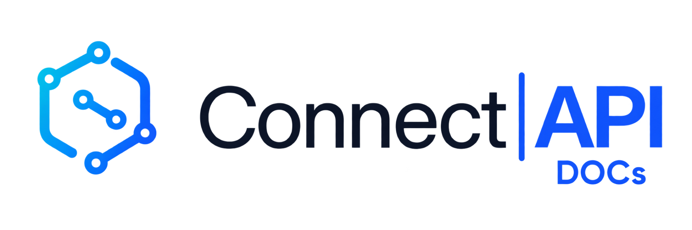

<p align="center">
  <picture>
    <source media="(prefers-color-scheme: dark)" srcset="../public/branding/connect-api/docs/connect-api-docs-dark.png">
    <source media="(prefers-color-scheme: light)" srcset="../public/branding/connect-api/docs/connect-api-docs-light.png">
    
  </picture>
</p>

# Connect|API DOCs

O `docs` é um service oficial da stack Connect|API baseado em **Scalar API Reference** e contratos OpenAPI/AsyncAPI versionados junto do código.

## Objetivos

- referência REST interativa da API nativa;
- referência Meta Compatible `/graph`;
- catálogo de eventos;
- exemplos de autenticação e uso;
- documentação versionada junto da aplicação;
- validação automática para impedir drift entre código e docs;
- imagem Docker própria, atualizada junto da stack.

## Service

O `docker-compose.yaml` publica o Scalar em:

```text
http://127.0.0.1:38082
```

O host/porta podem ser alterados por:

```text
ARGWS_CONNECT_DOCS_IMAGE
ARGWS_CONNECT_DOCS_HOST_PORT
ARGWS_CONNECT_BIND_ADDRESS
```

Imagem canônica da stack:

```text
ghcr.io/wkarts/argws-connect-docs:latest
ghcr.io/wkarts/argws-connect-docs:develop
```

O `docs/Dockerfile` deriva do Scalar API Reference e incorpora os contratos e os assets oficiais do **Connect|API DOCs** dentro da própria imagem. O deploy não depende de bind-mount do repositório.

Healthcheck do container:

```text
/health
```

## Documentos carregados no Scalar

```text
docs/openapi/connect-api.openapi.json
docs/openapi/meta-compatible.openapi.json
docs/asyncapi/connect-api-events.asyncapi.json
```

O Scalar recebe múltiplas sources e permite alternar entre REST nativo, Meta Compatible e Eventos.

## Branding — Connect|API DOCs

A documentação utiliza a identidade visual própria **Connect|API DOCs**, preservando a identidade principal do produto **Connect|API**.

Assets canônicos:

```text
public/branding/connect-api/docs/connect-api-docs-light.png
public/branding/connect-api/docs/connect-api-docs-light.jpg
public/branding/connect-api/docs/connect-api-docs-light.svg
public/branding/connect-api/docs/connect-api-docs-dark.png
public/branding/connect-api/docs/connect-api-docs-dark.jpg
public/branding/connect-api/docs/connect-api-docs-dark.svg
```

Assets compartilhados do produto:

```text
public/branding/connect-api/core/
```

Regras de apresentação:

- **light** é a apresentação principal e padrão;
- **dark** é uma variante opcional/adaptativa;
- READMEs usam `<picture>` para respeitar o tema do GitHub sem tornar dark o padrão;
- a imagem Docker de DOCs incorpora `core/` e `docs/`, evitando dependência de bind-mount;
- nomes técnicos de imagem, service, paths e registry permanecem inalterados.

## Geração

```bash
npm run docs:generate
```

O gerador percorre as definições `*.router.ts`, resolve mounts de routers e materializa o inventário OpenAPI da API nativa. A camada Meta Compatible e o catálogo de eventos recebem schemas/descrições específicas.

## Validação

```bash
npm run docs:check
```

O check falha quando:

- uma rota mudou e o OpenAPI não foi regenerado;
- o enum `Events` mudou e o AsyncAPI ficou stale;
- um arquivo gerado obrigatório não existe;
- o inventário de cobertura não corresponde ao código atual.

O workflow `Docs Integrity` também constrói a imagem `docs/Dockerfile`, valida o Compose, sobe o container Scalar, consulta `/health`, valida os três contratos publicados e confirma **as variantes light e dark do branding Connect|API DOCs**.

## Deploy automático de desenvolvimento

A pipeline `GHCR - Publish Development Images`, disparada por push em `develop`, publica API, Manager e DOCs para amd64/arm64. O canal de documentação é:

```text
ghcr.io/wkarts/argws-connect-docs:develop
```

Assim, mudanças documentais integradas em `develop` geram uma nova imagem de documentação no mesmo ciclo de publicação da aplicação.

## Estrutura

```text
docs/
├── Dockerfile
├── DOCUMENTATION-CONTRACT.md
├── README.md
├── scripts/
│   ├── generate-openapi.mjs
│   └── check-docs-impact.mjs
├── openapi/
│   ├── connect-api.openapi.json
│   ├── meta-compatible.openapi.json
│   └── coverage.json
├── asyncapi/
│   └── connect-api-events.asyncapi.json
└── guides/
    ├── getting-started.md
    ├── authentication.md
    ├── instances.md
    ├── messages.md
    ├── events.md
    ├── meta-compatible.md
    ├── deployment.md
    └── troubleshooting.md
```

## Regra de manutenção

Leia `DOCUMENTATION-CONTRACT.md` antes de finalizar mudanças públicas. Documentação é parte do Definition of Done do Connect|API.


## Endpoint público

Em deployments com reverse proxy, a URL canônica é `/docs/`. Existe também `deploy/docs/` para operação standalone/always-on.
